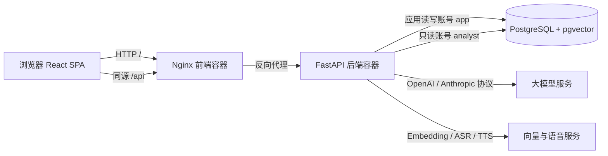

# 前后端与部署技术方案

本文档描述经管之星当前代码的技术实现、目录边界、主要文件职责和部署方式。开发约束分别见 [前端开发规范](frontend-conventions.md) 与 [后端开发规范](backend-conventions.md)，业务口径、数据粒度和安全边界以 [架构与实施边界](architecture.md) 为准。

## 1. 方案目标

系统面向企业经营数据问答，用户用自然语言提出问题，后端将问题解释为受约束的查询计划，由程序生成并校验 SQL，再使用只读数据库账号执行。系统同时提供会话、收藏、反馈、模型配置、语音、结果图表和 CSV 导出。

当前采用模块化单体和同源部署：

- 前端是 React 单页应用，负责认证页面、工作台交互、流式状态和结果展示。
- 后端是 FastAPI 应用，负责认证、权限、问数编排、数据访问和外部模型适配。
- PostgreSQL 同时保存经营分析数据和应用数据，`pgvector` 用于业务语义召回。
- Nginx 提供前端静态资源，并将同源 `/api` 请求转发到后端。
- Docker Compose 管理数据库、后端和前端三个服务。



## 2. 技术栈

| 层次         | 技术                                        | 用途                                    |
| ------------ | ------------------------------------------- | --------------------------------------- |
| 前端框架     | React 19、TypeScript 5                      | 页面、组件、严格类型和状态管理          |
| 路由与组件库 | React Router 7、Ant Design 5                | 客户端路由、表单、弹窗、表格和提示      |
| 样式与图表   | SCSS Modules、ECharts 6                     | 局部样式隔离和查询结果可视化            |
| 前端构建     | Vite 7、Prettier                            | 开发服务器、生产构建和格式检查          |
| 后端框架     | Python 3.13、FastAPI                        | JSON API、Cookie 认证和 NDJSON 流       |
| 数据访问     | SQLAlchemy、Alembic、psycopg                | 表定义、事务、迁移和 PostgreSQL 连接    |
| 查询安全     | Pydantic、SQLGlot                           | 查询计划校验和 SQL AST 校验             |
| 数据库       | PostgreSQL 18、pgvector                     | 经营数据、应用数据和语义向量            |
| 外部模型     | OpenAI Chat Completions、Anthropic Messages | 自然语言解释和自定义模型接入            |
| 部署         | Docker Compose、Nginx                       | 镜像构建、服务编排、静态资源和 API 代理 |

当前不使用 Redux、RTK Query、Vitest、React Testing Library 或 MSW。前端普通状态使用 React 原生能力，问数这类复杂流程使用 reducer 和职责明确的 Hook。

## 3. 仓库目录结构

```text
co/
├── AGENTS.md                  AI 和开发人员必须遵守的仓库级规则
├── .agents/skills/            项目级 Codex Skill；包含远程部署工作流
├── README.md                  项目入口、常用启动命令和功能说明
├── compose.yaml               PostgreSQL、后端、前端的 Compose 编排
├── .env.example               环境变量模板，不包含真实密钥
├── frontend/                  React 前端
│   ├── build/                 前端 Dockerfile 与 Nginx 配置
│   ├── public/                不经过模块打包的静态资源
│   ├── src/                   前端源代码
│   ├── index.html             Vite HTML 入口
│   ├── package.json           前端依赖与开发、构建命令
│   ├── tsconfig.json          TypeScript 严格模式配置
│   └── vite.config.ts         Vite 根目录、插件、端口和开发代理
├── backend/                   FastAPI 后端
│   ├── alembic/               数据库迁移环境与版本
│   ├── app/                   后端源代码
│   ├── tests/                 单元测试和 PostgreSQL 集成测试
│   ├── Dockerfile             后端运行镜像和启动流程
│   ├── alembic.ini            Alembic 入口配置
│   └── requirements.lock      容器使用的锁定依赖
├── scripts/                   环境初始化、授权、迁移、评估和冒烟脚本
└── docs/                      架构、规范、评审、验证和本技术方案
```

`.env`、`frontend/dist/`、依赖目录、缓存和本地运行数据不应提交。生产凭据只通过服务器 `.env` 注入。

## 4. 前端技术方案

### 4.1 分层与数据流

前端遵循“路由与页面组合 → 页面状态/Hook → API 传输层”的依赖方向：

1. `main.tsx` 初始化 React、Ant Design 中文环境和浏览器路由。
2. `App.tsx` 恢复登录态；未登录时展示登录或注册页，登录后加载工作区路由。
3. `WorkspaceLayout` 提供菜单、顶部栏和子路由出口。
4. 页面通过 `src/api/` 访问后端，不直接拼接接口 URL。
5. Ask 页面由 reducer 表达生成状态，Hook 管理流式请求、取消、资源加载和浏览器媒体资源。
6. 组件只消费有类型的数据和语义化回调，不直接处理 NDJSON 或数据库语义。

普通 JSON 请求统一经 `api/client.ts` 添加 `/api` 前缀、同源 Cookie 和安全错误解析。问数响应使用 NDJSON；`api/askStream.ts` 负责跨数据块拼接、逐行 JSON 解析、运行时结构校验、取消和终态完整性检查。

### 4.2 前端主要目录与文件

| 文件或目录                                               | 主要用途                                                            |
| -------------------------------------------------------- | ------------------------------------------------------------------- |
| `frontend/src/main.tsx`                                  | 浏览器入口；挂载 React、Ant Design 主题、中文区域和 `BrowserRouter` |
| `frontend/src/App.tsx`                                   | 恢复 `/auth/me` 登录态，在公开认证页和已登录工作区之间切换          |
| `frontend/src/App.module.scss`                           | 应用初始化加载状态的局部样式                                        |
| `frontend/src/router/paths.ts`                           | 登录、注册和工作区路径的唯一共享定义                                |
| `frontend/src/router/routes.tsx`                         | 已登录页面路由；组合 Ask、应用配置、回复校对和工作区布局            |
| `frontend/src/api/client.ts`                             | JSON 请求、同源 Cookie、统一错误及原始流响应基础能力                |
| `frontend/src/api/auth.ts`                               | 登录、注册、退出和当前用户接口与类型                                |
| `frontend/src/api/conversations.ts`                      | 会话列表、创建、详情、更新、删除和发起流式问数                      |
| `frontend/src/api/askStream.ts`                          | NDJSON 解析、事件校验、AbortSignal 取消和不完整响应检测             |
| `frontend/src/api/workbench.ts`                          | 数据目录、工作台设置、内置/自定义模型和模型连接测试                 |
| `frontend/src/api/questions.ts`                          | 常见问题和收藏的查询、添加与删除                                    |
| `frontend/src/api/feedback.ts`                           | 用户反馈提交、列表和管理员校对更新                                  |
| `frontend/src/api/audio.ts`                              | 录音转写和回答语音合成                                              |
| `frontend/src/models/ask.ts`                             | 查询计划、指标结果、基础资料结果和分析步骤等共享类型                |
| `frontend/src/lib/echarts.ts`                            | ECharts 按需注册和延迟加载边界，避免全部同步进入页面代码            |
| `frontend/src/layouts/WorkspaceLayout/`                  | 已登录工作台外壳、菜单、顶部栏及它们共享的 CSS Module               |
| `frontend/src/pages/Auth/`                               | 登录和注册页共用的品牌展示与表单布局                                |
| `frontend/src/pages/Login/LoginPage.tsx`                 | 用户名密码登录及注册入口                                            |
| `frontend/src/pages/Register/RegisterPage.tsx`           | 普通用户注册、前端校验、确认密码和注册后自动登录                    |
| `frontend/src/pages/Ask/AskPage.tsx`                     | Ask 页面组合，连接资源 Hook、会话 Hook 和展示组件                   |
| `frontend/src/pages/Ask/model/sessionReducer.ts`         | `idle/creating/streaming/cancelling` 状态机和纯状态转换             |
| `frontend/src/pages/Ask/hooks/useConversationSession.ts` | 会话加载、创建、流式发送、请求版本隔离、停止和重试                  |
| `frontend/src/pages/Ask/hooks/useAskResources.ts`        | 目录、设置、快捷问题、收藏和常见问题的加载与刷新                    |
| `frontend/src/pages/Ask/hooks/useVoiceRecorder.ts`       | `MediaRecorder` 生命周期、录音停止与转写                            |
| `frontend/src/pages/Ask/hooks/useSpeechPlayer.ts`        | 回答语音生成、播放、停止和资源释放                                  |
| `frontend/src/pages/Ask/components/`                     | 欢迎区、消息时间线、思考提示、输入器、结果卡、图表、抽屉和反馈弹窗  |
| `frontend/src/pages/Settings/SettingsPage.tsx`           | 欢迎语、快捷问题、常见问题和模型设置页面                            |
| `frontend/src/pages/Settings/AddModelDialog.tsx`         | OpenAI/Anthropic 自定义模型的新建、编辑和连接测试表单               |
| `frontend/src/pages/Feedback/FeedbackPage.tsx`           | 普通用户反馈列表和超级管理员回复校对页面                            |
| `frontend/src/styles/index.scss`                         | 全局样式入口，只汇总真正的全局 SCSS                                 |
| `frontend/src/styles/global.scss`                        | reset、页面根节点和全局基础样式                                     |
| `frontend/src/styles/overrides.scss`                     | 明确适用于全站的 Ant Design 覆盖                                    |
| `frontend/src/styles/management.module.scss`             | 设置与反馈管理内容区共用的局部样式                                  |

业务页面和组件默认使用 `*.module.scss`。Layout 内的 Header、Menu 和 Layout 可以共享同一个 Module；只有确实属于全站的规则才进入普通 `.scss`。

### 4.3 Ask 页面状态与流式交互

一次问数的前端流程如下：

```text
输入问题
  → 没有会话时先创建会话并写入 URL
  → 插入带稳定临时 ID 的用户消息
  → POST /api/conversations/{id}/ask
  → status 事件更新“正在思考”阶段
  → analysis 事件积累可审计分析步骤
  → result 事件替换为最终助手消息
  → 刷新会话列表与常见问题
```

切换会话或停止生成时使用 `AbortController` 取消旧请求，并用请求版本阻止旧结果覆盖新会话。流结束但没有 `result` 事件会被视为失败，不会静默显示为成功。

## 5. 后端技术方案

### 5.1 模块边界

后端采用模块化单体：

- `api/` 只处理 HTTP、认证依赖、请求模型、Cookie 和 NDJSON 编码。
- `services/` 负责需要跨多个步骤的业务用例编排。
- `repositories/` 负责应用数据读写、用户所有权、事务和数据库锁。
- `query/` 负责受控计划编译、AST 校验、只读执行和计算。
- `presentation/` 根据同一次查询结果生成确定性摘要、分析步骤和 CSV。
- 外部模型、数据库、语义召回等基础设施保持独立，不把 HTTP 对象传入业务层。

### 5.2 后端主要目录与文件

| 文件或目录                                  | 主要用途                                                            |
| ------------------------------------------- | ------------------------------------------------------------------- |
| `backend/app/main.py`                       | FastAPI 应用工厂、路由注册、CORS、Origin 防护、安全响应头和异常映射 |
| `backend/app/config.py`                     | 从环境变量加载数据库、模型、Cookie、音频、查询和注册配置            |
| `backend/app/db.py`                         | 应用读写池、只读查询池和用户级锁使用的连接池                        |
| `backend/app/schema.py`                     | `analytics` 与 `app` 两个 schema 的统一 SQLAlchemy 元数据           |
| `backend/app/errors.py`                     | 与 HTTP 解耦的稳定应用异常类型                                      |
| `backend/app/contracts.py`                  | 问数上下文、查询结果、执行记录和流事件的内部类型契约                |
| `backend/app/semantic.py`                   | 指标、维度、筛选、查询计划和允许组合的可执行业务语义                |
| `backend/app/catalog.py`                    | 经营表、字段、中文说明、数据粒度和查询目录的唯一代码来源            |
| `backend/app/information.py`                | 助手介绍、能力、表结构和日期范围等说明请求的受控契约                |
| `backend/app/llm.py`                        | OpenAI/Anthropic 模型调用、重试、错误归一化和结构化计划解析         |
| `backend/app/model_connections.py`          | 自定义模型 URL 解析及按用户派生的 Fernet 密钥加解密                 |
| `backend/app/audio.py`                      | ASR 录音转写与 TTS 回答语音适配                                     |
| `backend/app/retrieval.py`                  | 目录文档生成、Embedding 同步、精确匹配和 pgvector 余弦召回          |
| `backend/app/user_settings.py`              | 默认工作台设置、常见问题规范化与成功次数统计                        |
| `backend/app/seed.py`                       | 空数据库的固定演示数据和初始管理员初始化，不覆盖已有数据            |
| `backend/app/api/auth.py`                   | 登录、注册、退出、当前用户、Cookie 签发及进程内限流                 |
| `backend/app/api/conversations.py`          | 会话列表、详情、新建、置顶、重命名和删除接口                        |
| `backend/app/api/ask.py`                    | 打开 Ask 请求作用域，将服务事件编码为 `application/x-ndjson`        |
| `backend/app/api/catalog.py`                | 健康检查、数据目录和内置模型连接测试                                |
| `backend/app/api/workbench.py`              | 用户设置、常见问题、收藏和自定义模型管理接口                        |
| `backend/app/api/feedback.py`               | 反馈提交、按权限列出以及超级管理员校对接口                          |
| `backend/app/api/audio.py`                  | 语音转写和合成接口                                                  |
| `backend/app/api/exports.py`                | 对当前用户有权访问的历史回答生成 CSV 下载                           |
| `backend/app/api/dependencies.py`           | 当前用户等 FastAPI 依赖声明                                         |
| `backend/app/api/schemas.py`                | 所有 HTTP 请求体的 Pydantic 校验模型                                |
| `backend/app/services/ask.py`               | 问数主用例、真实阶段事件、取消、失败归一化和终态持久化              |
| `backend/app/repositories/ask.py`           | 问数准备事务和最终消息、审计、统计的原子终态事务                    |
| `backend/app/repositories/conversations.py` | 会话归属校验和会话 CRUD                                             |
| `backend/app/repositories/query_lock.py`    | PostgreSQL advisory lock，限制同一用户并发问数                      |
| `backend/app/repositories/catalog.py`       | 数据版本、实体目录、筛选值和数据范围读取                            |
| `backend/app/repositories/workbench.py`     | 工作台设置、收藏和常见问题持久化                                    |
| `backend/app/repositories/models.py`        | 用户自定义模型的增删改、选择和密文封装                              |
| `backend/app/repositories/feedback.py`      | 反馈所有权、筛选分页和校对更新                                      |
| `backend/app/repositories/messages.py`      | 按用户归属读取可导出的历史结果                                      |
| `backend/app/repositories/users.py`         | 用户查询和普通用户注册写入                                          |
| `backend/app/query/compiler.py`             | 将受控计划编译为参数化 SQL，并使用 SQLGlot 校验整棵 AST             |
| `backend/app/query/execution.py`            | 在 READ ONLY 事务中执行 SQL，设置超时并组装查询/对比结果            |
| `backend/app/query/calculations.py`         | Decimal 指标、同比/环比日期对齐和纯计算逻辑                         |
| `backend/app/query/display.py`              | 生成供用户核对的 SQL 与业务口径文本，不作为执行入口                 |
| `backend/app/presentation/answers.py`       | 从查询结果生成摘要、分析步骤和回答元数据                            |
| `backend/app/presentation/information.py`   | 仅从可信目录生成系统能力与业务数据说明                              |
| `backend/app/presentation/exports.py`       | CSV 格式化和公式注入防护                                            |
| `backend/alembic/`                          | 数据库迁移环境；`versions/` 按版本保存不可变迁移                    |
| `backend/tests/unit/`                       | 无真实数据库和模型的纯逻辑、状态和边界测试                          |
| `backend/tests/integration/`                | 本地 PostgreSQL、权限、隔离、持久化、数值和断连测试                 |

### 5.3 问数执行链路

后端不会执行模型自由生成的 SQL。核心流程是：

```text
认证与会话归属校验
  → 获取用户级 advisory lock
  → 保存用户问题并读取工作台/模型/历史上下文
  → 识别可信说明类问题，或读取数据版本和业务目录
  → 精确匹配 + pgvector 召回业务知识
  → 模型输出受约束的 Pydantic 查询计划
  → 校验指标、维度、日期和实体筛选
  → 程序编译参数化 SQL
  → SQLGlot 校验表、schema、函数和单条 SELECT
  → analyst 账号在 READ ONLY 事务中执行
  → Decimal 计算和确定性摘要/图表数据
  → 原子保存助手消息、查询审计、召回审计和成功统计
  → 释放用户锁
```

```
用户问题
  ↓
大模型生成 JSON 查询计划
  ↓
Pydantic 校验计划
  ↓
检查筛选值是否真实存在
  ↓
Python SQL 编译器选择表、字段、关联关系
  ↓
SQLGlot 检查 SQL 安全性
  ↓
SQLAlchemy 绑定参数并只读执行
  ↓
Python 计算环比、同比、毛利率等结果
```

大模型有理解权，没有自由操作数据库的权力。 它只能从允许的指标、维度、筛选和比较方式中生成计划，真正的 SQL 完全由后端规则控制

后端通过 `status`、`analysis`、`result` 三类 NDJSON 事件发送真实执行阶段。`result` 是唯一终态；成功、澄清、不支持、失败和取消都会形成一致的历史消息状态。

## 6. 数据库与安全方案

### 6.1 数据分区

PostgreSQL 使用两个逻辑 schema：

- `analytics`：组织、客户、产品、合同、收入、成本、回款、应收和目标等经营数据。
- `app`：用户、会话、消息、查询审计、反馈、收藏、设置、数据版本和语义检索数据。

`backend/app/schema.py` 是当前结构的统一元数据，结构演进必须新增 Alembic 迁移。领域表及字段的中文含义和粒度由 `backend/app/catalog.py` 定义，并由迁移写入数据库 COMMENT。

### 6.2 数据库账号

| 账号       | 权限和用途                                       |
| ---------- | ------------------------------------------------ |
| `postgres` | 仅用于数据库容器首次初始化角色和扩展             |
| `app`      | schema 所有者；运行迁移并读写应用数据            |
| `analyst`  | 只有 `analytics` 的 `USAGE/SELECT`，用于问数查询 |

`scripts/grant-query.py` 在后端容器启动时重新确认只读授权。即使应用层 SQL 校验失误，数据库账号仍不具备写入或读取 `app` schema 的权限。

### 6.3 应用安全边界

- 登录态使用 12 小时 JWT，保存在 HTTP-only、SameSite=Strict Cookie 中。
- 修改请求校验 `Origin`，允许来源由 `ALLOWED_ORIGIN` 配置。
- 登录和注册使用按来源 IP 的进程内限流；多实例生产环境需要共享限流。
- 新注册账号固定为普通用户；反馈跨用户处理只允许超级管理员。
- 会话、消息、收藏、反馈、设置、导出和自定义模型始终按当前用户过滤。
- 用户密码使用随机盐 scrypt 摘要；自定义模型密钥使用按用户派生的 Fernet 认证加密。
- 浏览器不会收到模型密钥、数据库凭据、原始上游错误或内部连接信息。
- 查询值全部使用绑定参数；SQL 只来自程序编译器，并受 AST、只读事务、10 秒超时和结果数量限制。

## 7. 配置方案

首次运行执行 `python3 scripts/setup-env.py`，它从 `.env.example` 生成权限为 `0600` 的 `.env`，并保留已经存在的配置。不要把 `.env` 提交到 Git。

主要配置分组如下：

| 配置                                       | 用途                               |
| ------------------------------------------ | ---------------------------------- |
| `POSTGRES_PASSWORD`                        | PostgreSQL 管理账号初始化密码      |
| `APP_DB_PASSWORD`                          | 应用读写账号密码                   |
| `QUERY_DB_PASSWORD`                        | analyst 只读账号密码               |
| `DATABASE_URL`                             | 后端应用读写连接                   |
| `QUERY_DATABASE_URL`                       | 问数只读连接                       |
| `JWT_SECRET`                               | 会话令牌签名密钥                   |
| `ADMIN_PASSWORD`                           | 仅首次初始化 admin 账号时使用      |
| `REGISTRATION_ENABLED`                     | 是否允许访客注册普通用户           |
| `LLM_BASE_URL`、`LLM_MODEL`、`LLM_API_KEY` | 内置问数模型                       |
| `MODEL_ENCRYPTION_SECRET`                  | 用户自定义模型密钥加密根密钥       |
| `EMBEDDING_*`                              | 语义目录向量模型、地址、密钥和维度 |
| `AUDIO_*`、`ASR_MODEL`、`TTS_MODEL`        | 录音转写和语音合成                 |
| `ALLOWED_ORIGIN`、`COOKIE_SECURE`          | 浏览器来源与 Cookie 安全策略       |
| `APP_BIND_ADDRESS`、`APP_PORT`             | 前端容器在宿主机上的监听地址和端口 |

服务器必须稳定备份数据库卷、`.env` 和 `MODEL_ENCRYPTION_SECRET`。更换加密根密钥前需要迁移已有密文，否则历史自定义模型密钥无法解密。

## 8. 构建与部署方案

### 8.1 Compose 服务及启动顺序

`compose.yaml` 定义三个服务：

| 服务       | 镜像与职责                        | 对外端口                           | 健康/依赖                               |
| ---------- | --------------------------------- | ---------------------------------- | --------------------------------------- |
| `db`       | `pgvector/pgvector`，持久化数据库 | 仅 `127.0.0.1:54330`               | `pg_isready`                            |
| `backend`  | 项目后端镜像，运行 FastAPI        | 不直接暴露                         | 等待 db healthy，自身检查 `/api/health` |
| `frontend` | Node 构建后由 Nginx 提供静态文件  | 本地默认 `127.0.0.1:5178`，云端 80 | 等待 backend healthy                    |

后端容器启动命令依次执行：

1. `alembic upgrade head`：升级数据库结构。
2. `scripts/grant-query.py`：确认 analyst 只读授权。
3. `python -m app.seed`：仅在需要时初始化版本化演示数据和管理员，不覆盖已有业务数据。
4. `uvicorn app.main:app`：启动 API 服务。

前端镜像使用多阶段构建：Node 阶段执行 `npm ci` 和 `npm run build`，最终镜像只包含 Nginx 和 `dist` 静态文件。Nginx 对 `/api/` 关闭代理缓冲，以便 NDJSON 和音频请求正常工作；其他路径回退到 `index.html` 支持前端路由。

### 8.2 本地完整环境

```sh
python3 scripts/setup-env.py
docker compose up --build -d
docker compose ps
```

访问 `http://127.0.0.1:5178`。数据库映射到 `127.0.0.1:54330`，数据保存在命名卷 `postgres_data_v2`。

只开发前端时，保留本地 Compose 服务并启动 Vite：

```sh
cd frontend
VITE_API_PROXY=http://127.0.0.1:5178 npm run dev
```

Vite 页面地址为 `http://127.0.0.1:5881`。如果联调云端 API，将 `VITE_API_PROXY` 改为云端地址。

### 8.3 当前云服务器部署

服务器代码目录为 `/opt/ai-wenshu/co`，运行 `feature/co` 分支。服务器 `.env` 至少应包含：

Codex 中可使用项目级 `$deploy-ai-wenshu` Skill 执行标准部署；它位于 `.agents/skills/deploy-ai-wenshu/`，固定使用 Workbench 实例、服务器目录和下述安全检查流程。

```dotenv
COOKIE_SECURE=false
ALLOWED_ORIGIN=http://8.137.78.125
APP_BIND_ADDRESS=0.0.0.0
APP_PORT=80
```

当前尚未配置 HTTPS，因此不应在公网 HTTP 页面输入正式敏感密钥。配置域名和证书后，应把 `ALLOWED_ORIGIN` 改为 HTTPS 地址并设置 `COOKIE_SECURE=true`。

标准发布步骤：

```sh
cd /opt/ai-wenshu/co
git status --short --branch
git pull --ff-only origin feature/co
docker compose up --build -d
docker compose ps
curl --fail http://127.0.0.1/api/health
```

发布前必须确认服务器工作树没有未提交改动；使用 `--ff-only`，避免服务器自动产生合并提交。Compose 重建不会删除命名卷，禁止为了普通发布执行 `docker compose down -v`。

若业务目录、指标、维度或标准实体发生变化，发布完成后显式同步语义索引：

```sh
docker compose run --rm backend python -m app.retrieval sync
```

向量同步失败不会阻止 API 启动，问数会回退到静态业务目录，但语义召回能力会暂时降低。

### 8.4 发布检查与回退

发布后至少检查：

```sh
docker compose ps
curl --fail http://127.0.0.1/api/health
docker compose logs --tail=100 backend
docker compose logs --tail=100 frontend
```

再从外部浏览器检查登录/注册、Ask 页面、普通查询和历史会话。除非明确需要，不在部署验收中调用真实模型，以免消耗额度；可优先检查不调用模型的健康接口和说明类问题。

代码回退应选择已经确认兼容当前数据库迁移的 Git 提交，切换后重新执行 `docker compose up --build -d`。Alembic 迁移默认只向前执行；涉及数据库结构的版本不能仅回退代码，必须先制定数据兼容或单独迁移方案。

## 9. 脚本职责

| 文件                        | 用途                                                   |
| --------------------------- | ------------------------------------------------------ |
| `scripts/setup-env.py`      | 首次生成 `.env` 和随机基础密钥，已有文件不覆盖         |
| `scripts/docker-init.sh`    | 数据库卷首次创建时建立 app、analyst 角色和 vector 扩展 |
| `scripts/grant-query.py`    | 迁移后授予 analyst 对 analytics 的只读权限             |
| `scripts/transfer-data.py`  | 数据导出、恢复和旧数据库迁移，并核对逐表记录数         |
| `scripts/evaluate.py`       | 显式运行真实模型评估，会产生外部 API 费用              |
| `scripts/retest-failed.py`  | 重测评估报告中的失败案例，会产生外部 API 费用          |
| `scripts/smoke-orbstack.py` | 对本地完整服务运行真实问数冒烟，会产生外部 API 费用    |
| `scripts/dev-legacy.sh` 等  | 旧嵌入式 PostgreSQL 环境维护，不是当前推荐启动方式     |

## 10. 开发与验证流程

前端变更：

```sh
cd frontend
npm run format:check
npm run build
```

后端纯单元测试：

```sh
PYTHONPATH=backend .venv/bin/pytest backend/tests/unit -q
```

后端标准测试入口（未设置 `TEST_DATABASE=1` 时自动跳过数据库集成测试）：

```sh
PYTHONPATH=backend .venv/bin/pytest backend/tests -q
```

涉及数据库、权限、迁移、流式持久化或数值计算时，在确认连接目标为非生产本地数据库后运行：

```sh
TEST_DATABASE=1 PYTHONPATH=backend .venv/bin/pytest backend/tests -q
```

依赖变化还必须重建后端镜像并执行：

```sh
docker compose exec -T backend pip check
```

真实模型评估不是普通构建步骤，只有在明确需要时才执行。Ask 页面变更应使用真实本地后端覆盖受影响的正常、错误、取消、流式或历史路径。

## 11. 当前边界与后续演进

- 当前部署适合单机 Compose；多实例前需要共享限流、独立迁移任务、集中日志和请求追踪。
- 公网生产环境仍需要 HTTPS、域名、备份恢复演练、监控告警和并发压测。
- 组织级数据权限尚未实现；未来需要在目录、查询编译或数据库 RLS 层强制执行，不能只依靠模型提示词。
- 前端当前没有自动化测试框架；若交互复杂度继续增长，再评估 Vitest、React Testing Library 和 MSW。
- 前端生产包仍有大 chunk 警告；当前 PC 页面可接受，后续首屏性能成为目标时再做更细粒度按需加载。
- 历史 Alembic 迁移存在引用运行时目录的技术债务；新增迁移必须保持自包含并验证空库完整重放。
